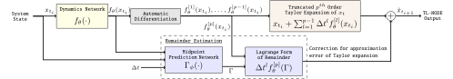
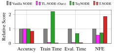

# Taylor-Lagrange Neural Ordinary Differential Equations

Code for the paper:

> Franck Djeumou*, Cyrus Neary*, Eric Goubault, Sylvie Putot, and Ufuk Topcu. "Taylor-Lagrange Neural Ordinary Differential Equations: Toward Fast Training and Evaluation of Neural ODEs" Initial submission to _IJCAI_ (2022).
> [[arxiv]](https://arxiv.org/abs/2201.05715) [[bibtex]](#bibtex)

\*Equal Contribution

<p align="center">


</p>

This package provides the following algorithms:

- Learn a computationally cheap yet accurate solver (fixed-order Taylor-Lagrange expansion with learned midpoint) for evaluating Neural ordinary equations given sampled trajectories.

- Learn both the underlying differential equation (and at the same time the cheap solver) of an unknown dynamcal system from sampled trajectories


# Installation

This package requires [``jax``](https://github.com/google/jax) to be installed: The choice of CPU or GPU version depends on the user but the CPU is installed by default along with the package.
The package further requires [``dm-haiku``](https://github.com/deepmind/dm-haiku) for neural networks in jax and [``optax``](https://github.com/deepmind/optax) a gradient processing and optimization library for JAX. The following commands install everything that is required (except for the GPU version of JAX which must be installed manually):

```
pip install numpy matplotlib scipy tqdm pyyaml
cd TayLaNets/
python3 -m pip install -e . 
```

# Examples

## Stiff Dynamics example

To reproduce the experiments on the linear stiff dynamics, execute the set of command below.
```
# Generate the data set
cd TayLaNets/examples_taylanets/stiff_dynamics
python generate_sample.py --dt 0.01 # Do the same for the other time steps consider in the paper.

# Learn midpoint
cd TayLaNets/examples_taylanets/stiff_dynamics
python learn_midpoint.py --train_batch_size 500 --test_batch_size 1000 --lr_init 1e-5 --lr_end 1e-12 --test_freq 5000 --save_freq 10000 --n_steps 1 --nepochs 500 --w_decay 0 --grad_clip 0 --method tayla --order 1 --atol 1e-8 --rtol 1e-8 --trajfile data/stifflinear_dt0.01.pkl

# Learn the dynamics and the midpoint

python learn_dynamics.py --train_batch_size 500 --test_batch_size 250 --lr_init 1e-2 --lr_end 1e-4 --test_freq 1000 --save_freq 20000 --n_steps 1 --nepochs 100 --method tayla --atol 1e-8 --rtol 1e-8 --trajfile data/stifflinear_dt0.01.pkl --mid_freq_update 10 --pen_remainder 1e-2 --mid_lr_init 1e-4 --mid_lr_end 1e-12 
```

## MNIST Classification
To train this model, Tensorflow and Tensorflow datasets must be installed as described [here.](https://www.tensorflow.org/datasets/overview). Then, run the following command to train the Taylor Lagrange Neural ordinary differential equation.
```
python tayla_mnist.py --train_batch_size 500 --test_batch_size 500 --lr_init 1e-2 --lr_end 1e-2 --test_freq 400 --save_freq 10000 --n_steps 2 --order 1 --pen_remainder 1e1 --nepochs 500 --method tayla --atol 1.4e-8 --rtol 1.4e-8 --grad_clip 0.001 --mid_freq_update 400 --mid_lr_init 1e-4 --mid_lr_end 1e-8 --grad_clip 0.001 --dur_ending_sched 50 --ending_lr_init 1e-4 --ending_lr_end 1e-4
```

## FFJORD MINIBOONE for density estimation 
To train this model, the data must be downloaded following instructions from [gpapamak/maf](https://github.com/gpapamak/maf) and placed in `data/`. Only `MINIBOONE` is needed for experiments in the paper. The code in `datasets/`, copied from [jacobjinkelly/easy-neural-ode](https://github.com/jacobjinkelly/easy-neural-ode), will create an interface for the `MINIBOONE` dataset once it's downloaded. 

Then, you need to run the following command to learn a model for the tabular example.
```
python tayla_ffjord_tabular.py --train_batch_size 1000 --nepochs 400 --n_steps 8 --method tayla --lr_init 1e-3 --lr_end 1e-3 --w_decay 0.001 --grad_clip 0. --pen_remainder 5e1 --order 1 --mid_freq_update 100 --mid_lr_init 1e-4 --mid_lr_end 1e-7 --dur_ending_sched 150 --ending_lr_init 1e-5 --ending_lr_end 1e-5
```


## Acknowledgements
The code in `taylanets/ode.py`, `examples_taylanets/mnist/jinkelly_mnist`, and `examples_taylanets/ffjord_tabular/jinkelly_ffjord_tabular.py` is modified from [jacobjinkelly/easy-neural-ode](https://github.com/jacobjinkelly/easy-neural-ode) and provide jax implementations of adaptive-stepping numerical solvers, comparisons with TayNODE and RNODE on classification task, and comparisons with TayNODE and RNODE on the density estimation task.


# BibTeX

```
@misc{djeumou2022taylorlagrange,
      title={Taylor-Lagrange Neural Ordinary Differential Equations: Toward Fast Training and Evaluation of Neural ODEs}, 
      author={Franck Djeumou and Cyrus Neary and Eric Goubault and Sylvie Putot and Ufuk Topcu},
      year={2022},
      eprint={2201.05715},
      archivePrefix={arXiv},
      primaryClass={cs.LG},
      url={https://arxiv.org/abs/2201.05715}
}
```
